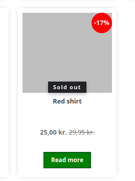

# Kadoco Product Badges module

## Overview

This module, developed by Kadoco, provides the functionality thats adds different kind of badges to products. Badges are added in the product listing, product page and other places. 

## Features

* Provides these type of badges out of the box. isTierPriced, isFreeDelivery, isNew, isSoldOut and discountPercentage
* Easy to customize and to add more
* Example:
  
* 

## Contributing

For any contributions, please make a pull request. We appreciate any contributions to improve this project.

## License

This project is licensed under the APACHE-2.0 - see the [LICENSE.md](LICENSE.md) file for details

## Support

If you encounter any issues or require further information, please contact hej@kadoco.se.
